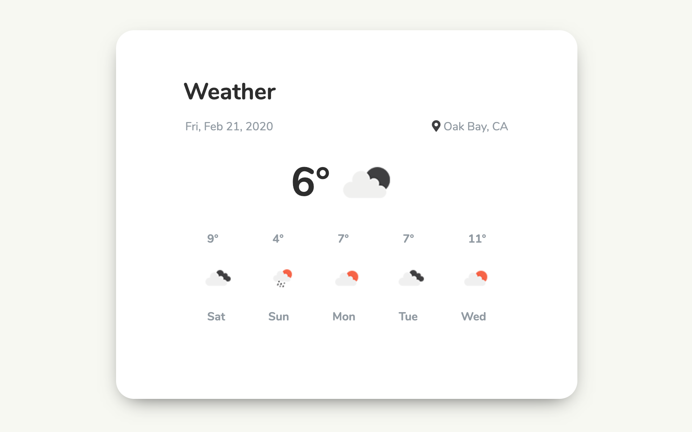
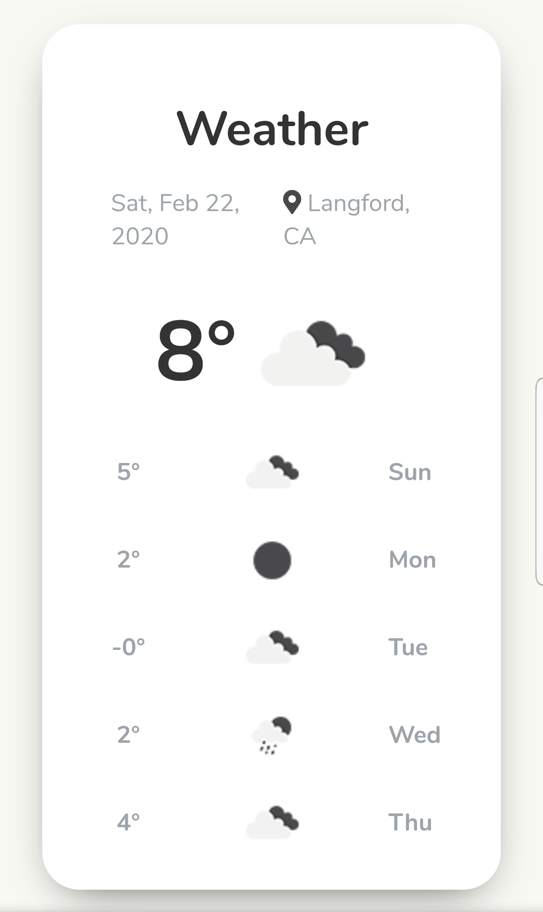

# Highlights

- Uses [OpenWeatherMap](https://openweathermap.org) API
- Uses Google's [Geocoding](https://developers.google.com/maps/documentation/geocoding/start) API
- Fetches your current location
- Fetches the current weather of your area
- Fetches the 5 day forecast

### Desktop Screenshot



### Mobile Screenshot



---

_Looking for a shareable component template? Go here --> [sveltejs/component-template](https://github.com/sveltejs/component-template)_

---

## svelte app

This is a project template for [Svelte](https://svelte.dev) apps. It lives at https://github.com/sveltejs/template.

To create a new project based on this template using [degit](https://github.com/Rich-Harris/degit):

```bash
npx degit sveltejs/template svelte-app
cd svelte-app
```

_Note that you will need to have [Node.js](https://nodejs.org) installed._

## Get started

Install the dependencies...

```bash
cd svelte-app
npm install
```

...then start [Rollup](https://rollupjs.org):

```bash
npm run dev
```

Navigate to [localhost:5000](http://localhost:5000). You should see your app running. Edit a component file in `src`, save it, and reload the page to see your changes.

By default, the server will only respond to requests from localhost. To allow connections from other computers, edit the `sirv` commands in package.json to include the option `--host 0.0.0.0`.
